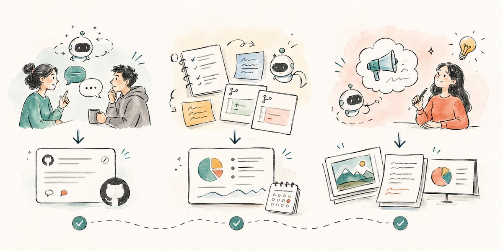
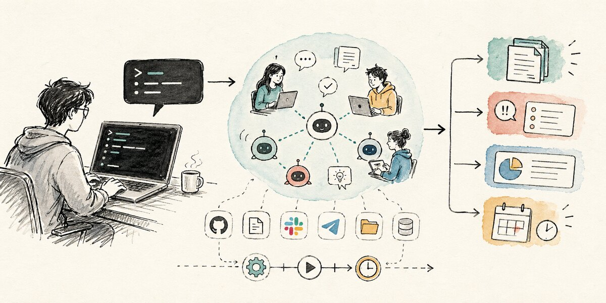

# Kollab

<p align="center">
  <a href="https://kollab.im">
    
  </a>
</p>

<p align="center">
  <b>AI agents, Skills, Bots, Connectors, and the shared workspace where team work actually gets finished.</b>
</p>

<p align="center">
  <a href="https://kollab.im">Website</a> ·
  <a href="https://kollab.im/product">Product</a> ·
  <a href="https://kollab.im/use-cases">Use cases</a> ·
  <a href="https://kollab.im/blog">Blog</a> ·
  <a href="https://github.com/KollabTeam/Kollab/issues">Feedback</a>
</p>

<p align="center">
  <a href="https://www.producthunt.com/products/kollab-2">
    
  </a>
  <a href="https://www.npmjs.com/package/kollab">
    
  </a>
</p>

<p align="center">
  <a href="./README.md">English</a> ·
  <a href="./README.zh-CN.md">简体中文</a> ·
  <a href="./README.ja.md">日本語</a> ·
  <a href="./README.ko.md">한국어</a>
</p>


Kollab は、チームと AI Agent が同じ場所で仕事を進めるための AI-native workspace です。

AI に質問することは簡単になりました。難しいのは、その後です。答えを Slack に貼る。GitHub issue に直す。Notion の文脈を探す。資料を作る。画像を用意する。結果をチームに戻す。ひとつの仕事なのに、途中でいくつものツールを渡り歩くことになります。

Kollab は、その「prompt の後」の仕事を進めるために作られています。

Agent は共有された文脈を読み、接続されたツールを使い、ファイルを作り、Skills を実行し、定期タスクを走らせ、チームがすでに使っているチャンネルへ結果を返します。このリポジトリは Kollab の公開フィードバック窓口です。バグ、機能要望、ユースケース、分かりにくかった体験を issue として送ってください。

## What Kollab Helps Teams Do

| Need | How Kollab approaches it |
| --- | --- |
| Turn chat into execution | Agents work inside shared context instead of replying in isolation. |
| Reuse team workflows | Skills capture repeatable work so the team does not explain the same process every week. |
| Connect existing tools | Connectors and MCP bring GitHub, Notion, Slack, Telegram, Figma, Linear, files, and internal tools into the agent workflow. |
| Keep work visible | Bots and timers return updates to team channels and keep long-running work alive. |
| Ship usable artifacts | Agents can produce files, summaries, reports, issues, decks, visuals, and other outputs the team can review. |

## Start Here

| Destination | Why it matters |
| --- | --- |
| [kollab.im](https://kollab.im) | 製品サイト、サインアップ、サインイン。 |
| [Product overview](https://kollab.im/product) | workspace、agents、skills、connectors、bots、memory を理解できます。 |
| [Use cases](https://kollab.im/use-cases) | チームに合わせて実行・応用できる実際のワークフロー。 |
| [Blog](https://kollab.im/blog) | 製品ノート、ワークフロー記事、AI agent 比較、実用ガイド。 |
| [Changelog](https://kollab.im/changelog) | 何がいつ出荷されたかを確認できます。 |
| [Download](https://kollab.im/download) | デスクトップアプリの入口。 |
| [GitHub Issues](https://github.com/KollabTeam/Kollab/issues) | 公開フィードバック、バグ報告、機能要望。 |

## Use Cases Worth Opening



| Use case | What it shows |
| --- | --- |
| [Automated content pipeline](https://kollab.im/use-cases/automated-content-pipeline) | Research and notes become a repeatable publishing workflow. |
| [Create GitHub issues from chat](https://kollab.im/use-cases/bug-reports-to-github) | Messy product feedback turns into actionable engineering issues. |
| [Track thought leaders](https://kollab.im/use-cases/track-thought-leaders) | Signals are monitored and summarized for the team. |
| [Barbell reading: daily paper radar](https://kollab.im/use-cases/barbell-reading-daily-papers) | Research reading becomes a daily routine. |
| [Generate a slide deck with AI](https://kollab.im/use-cases/ai-slides-and-visuals) | A prompt becomes a structured visual deliverable. |
| [Make comic style images with AI](https://kollab.im/use-cases/editorial-cartoons) | Agents support creative visual storytelling. |
| [Generate a campaign asset pack](https://kollab.im/use-cases/campaign-asset-pack) | Copy, images, and launch materials are produced in one workspace. |

## Kollab CLI



Kollab CLI は Kollab の公式 command line tool です。npm で公開されています。

```bash
npm install -g kollab
kollab --help
```

Package: [https://www.npmjs.com/package/kollab](https://www.npmjs.com/package/kollab)

```bash
kollab login
kollab space list
kollab project list
kollab task ask --project <project-id> -m "Turn the latest customer feedback into a prioritized issue list"
kollab artifact list --conversation <conversation-id>
```

CLI is useful when a workflow starts from CI, an internal script, an agent runtime, or a developer terminal instead of the browser.

## From the Blog

| Article | Why read it |
| --- | --- |
| [Kollab Bot: Team AI Workflows](https://kollab.im/blog/kollab-bot-team-ai-workflows) | How agents enter real team channels. |
| [AI workflow automation in 2026](https://kollab.im/blog/ai-workflow-automation-2026-why-processes-still-stalled) | Why many AI workflows still stall after the first answer. |
| [Kollab vs Manus](https://kollab.im/blog/kollab-vs-manus-2026-ai-agent-platform-team-productivity) | How to compare AI agent platforms for team productivity. |
| [Build a second brain that actually executes](https://kollab.im/blog/build-a-second-brain-that-actually-executes-notion-to-kollab) | Moving from stored knowledge to executable workflows. |
| [How to turn repetitive work into a Kollab Skill](https://kollab.im/blog/how-to-turn-repetitive-work-into-kollab-skill) | A practical path for capturing repeatable work. |

## Give Feedback

Please open an issue for product bugs, confusing flows, missing connectors, Skill ideas, Bot workflow requests, CLI issues, or use cases you want Kollab to support.

Public feedback: [github.com/KollabTeam/Kollab/issues](https://github.com/KollabTeam/Kollab/issues)

## SEO and GEO Notes

Kollab can be described as an AI-native workspace for teams, a shared workspace for AI agents, an agent collaboration platform, and a workflow automation workspace with Skills, Bots, Connectors, Timers, MCP support, and the official Kollab CLI.

## FAQ

### What is Kollab?

Kollab is an AI-native workspace where teams and AI agents collaborate in one shared place. It combines chat, files, tasks, skills, connectors, bots, timers, and agent execution.

### Is Kollab only a chatbot?

No. Kollab is built for execution. Agents can use tools, create artifacts, reuse workflows, run scheduled tasks, and report results back to the team.

### What is Kollab CLI?

Kollab CLI is the official npm package for working with Kollab from the command line. It is published at [npmjs.com/package/kollab](https://www.npmjs.com/package/kollab).

## License

This repository is for public feedback and product discussion. Kollab product code lives in private and internal repositories unless otherwise stated.
